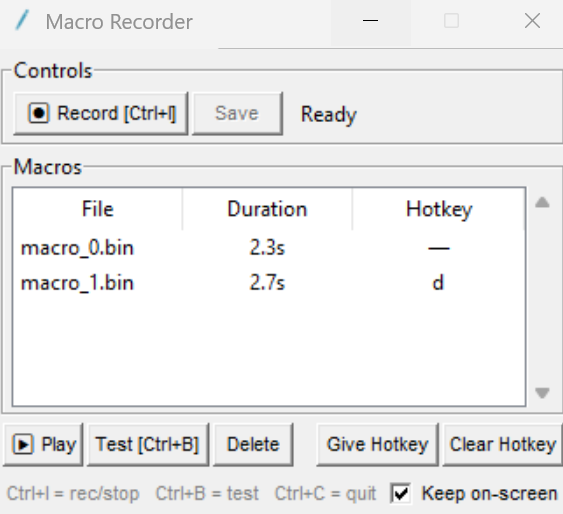

 

# Windows Macro Recorder
Windows Macro Recorder accurately captures mouse and keyboard input. It is completely FREE and has no ads. 

   

Uses low-level Win32 hardware input injection for extremely precise mouse recording. It even performs well with first person games. It is coded using Python, and the simple GUI is made with tkinter. 

## Usage
- Ctrl+G to start or stop recording a new macro 
- Ctrl+B to test that macro 
- Hit save to keep it 
- Assign hotkeys to saved macros 
- You can cancel a macro by pressing its hotkey again 

## Installation
```
build.bat
```
That's all!